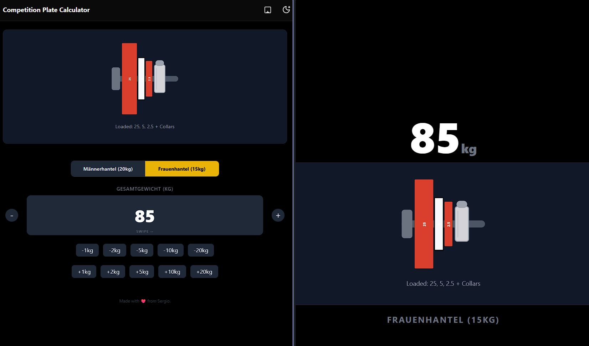

# Wettkampf Scheiben-Rechner

Jeder kennt das nervige Rechnen, wenn man als Scheibenstecker bei einem Wettkampf hilft.
Als Erleichterung habe ich einen interaktiver Rechner mit **React Native (Expo)** und **NativeWind** entwickelt. Diese Webapp visualisiert die korrekte Beladung der Hantel für ein gewünschtes Zielgewicht und berücksichtigt dabei die allgemein gültigen Wettkampfregeln, einschließlich der Verwendung von Klemmen und Trainingsscheiben.


_Linkes Browserfenster für die Einstellung; Rechtes Browserfenster für die Anzeige auf einem externen Monitor_

## ✨ Funktionen

- **Visuelle Hantel-Beladung:** Echtzeit-Visualisierung der Scheiben auf der Hantelaufnahme
- **Wettkampf- & Trainings-Regeln:**
  - Unterstützt **Männerhantel (20kg)** und **Frauenhantel (15kg)**.
  - Automatische **Klemmen-Regelung**: Klemmen (2,5kg pro Stück) werden erst hinzugefügt, wenn das Gewicht 30kg (Männer) bzw. 25kg (Frauen) erreicht.
  - **Trainingsscheiben**: Intelligente Bevorzugung großer "Trainingsscheiben" (5kg/2,5kg) bei leichteren Gewichten (<45kg(M); <40kg(F)), um die korrekte Hantelhöhe zu gewährleisten.
  - Korrekte Sortierung der Scheiben und Klemmen
  - **Gewichtslimits:** Maximales Gewicht begrenzt auf **300kg (Männer)** und **225kg (Frauen)**.
- **Intuitive Steuerung:**
  - **Swipe-Anpassung:** Wische horizontal über die Gewichtsanzeige, um das Gewicht in 1kg-Schritten zu ändern (blockiert vertikales Scrollen auf Mobilgeräten für bessere Bedienung).
  - **Mausrad-Support:** Gewichtsanpassung durch Scrollen am Desktop.
- **Externes Display 🖥️:**
  - Öffne eine dedizierte Route `/display` Ansicht für einen zweiten Monitor.
  - **Echtzeit-Synchronisation:** Änderungen auf dem Hauptbildschirm werden sofort via Broadcast Channel API auf das externe Display übertragen (kein Server notwendig).
- **Design:** Voll integrierter **Dunkelmodus (Dark Mode)** und optionaler Hellmodus (Beta).

## 🛠️ Tech Stack

- **Framework:** [Expo](https://expo.dev/) (React Native)
- **Routing:** [Expo Router](https://docs.expo.dev/router/introduction/)
- **Styling:** [NativeWind](https://www.nativewind.dev/) (Tailwind CSS für React Native)
- **Icons:** Lucide React Native

Ich wollte diesen Tech Stack gerade testen und habe ihn deswegen bei der Webapp genutzt. Die Auswahl hatte sonst keinen bestimmten Hintergrund gehabt.

## 🚀 Erste Schritte

Folgende Schritte sind notwendig, um die App lokal auf deinem Computer auszuführen.

### Voraussetzungen

- **Node.js** muss installiert sein.
- **npm** als Paketmanager.

### Installation

1.  **Repository klonen:**

    ```bash
    git clone https://github.com/Sucuk93/plate-calculator.git
    cd plate-calculator
    ```

2.  **Abhängigkeiten installieren:**
    ```bash
    npm install
    ```

### App starten

Starte den Entwicklungsserver:

```bash
npx expo start
```

- **Web:** Drücke `w` im Terminal, um die App im Browser zu öffnen.
  - Alternativ `localhost:8081` im Browser aufrufen
- **Mobil:** Scanne den QR-Code mit der **Expo Go** App auf deinem Android- oder iOS-Gerät.

## 📖 Bedienung

1.  **Hanteltyp wählen:** Wechsle zwischen "Männerhantel" (20kg) und "Frauenhantel" (15kg).
2.  **Gewicht einstellen:** über Buttons, horizontale Wischgesten über die Gewichtsanzeige oder alternativ über das Mausrad.
3.  **Externes Display:**
    - Klicke auf das **Monitor-Icon** oben rechts.
    - Ziehe den neuen Tab auf einen zweiten Bildschirm oder Beamer.
    - Steuere das Gewicht über den Haupt-Tab – die Anzeige aktualisiert sich synchron.

## 🤝 Mitwirken

Beiträge sind willkommen! Erstelle gerne einen Pull Request.

## 📄 Lizenz

Dieses Projekt ist Open-Source und unter der [MIT Lizenz](LICENSE) verfügbar.
